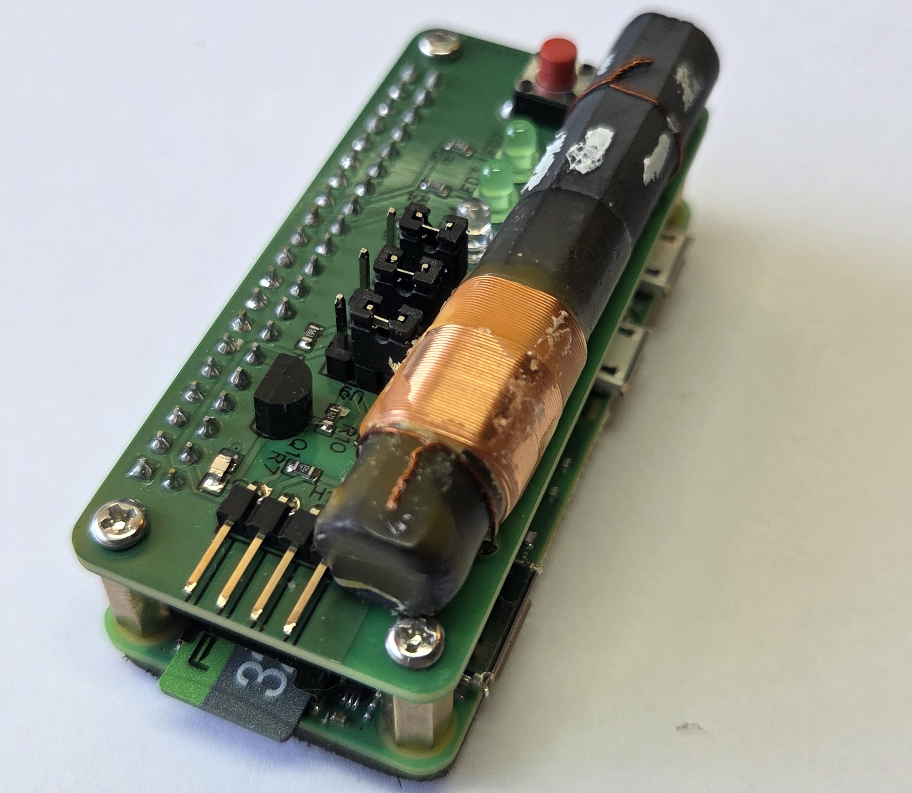
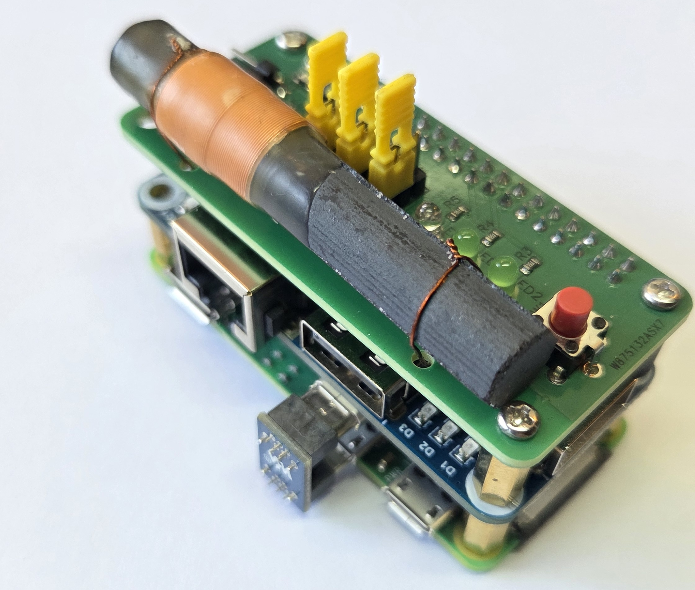
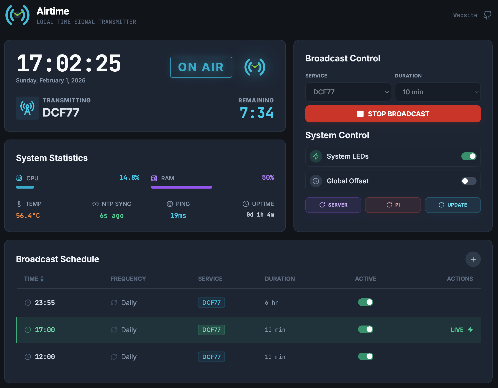

# [Airtime](https://airtime.diy/): Local Time-signal Transmitter

**[Airtime](https://airtime.diy/)** transmits precise time signals over radio frequencies (DCF77, WWVB, MSF, JJY40, JJY60) using the [txtempus](https://github.com/hzeller/txtempus) transmitter. Features a modern dashboard for monitoring, scheduling broadcasts, and controlling hardware.
<table>
  <tr>
    <td>
      <br>
      <em>Airtime with the custom Pi Hat</em>
    </td>
    <td>
      <br>
      <em>Airtime with additional USB/Ethernet expansion</em>
    </td>
  </tr>
</table>

## 1. Prerequisites

### Hardware
This system makes use of several hardware components:
- A [Raspberry Pi Zero 2W](https://www.raspberrypi.com/products/raspberry-pi-zero-2-w/)
- MicroSD Card (8GB or larger)
- Custom Airtime Pi Hat (see [docs/AirTime-Hat-PCB/](docs/AirTime-Hat-PCB/))
- Optional (but highly recommended): heatsink for the Pi Zero 2W.
- Optional (but highly recommended): DCF77 decoder coil (this still works for the other services) [Alibaba](https://www.aliexpress.com/item/1005007832198551.html)
- Optional: [Ethernet/USB HUB HAT Expansion](https://www.amazon.com/expansi%25C3%25B3n-USB-HUB-HAT-compatible/dp/B07X1BH5FN?__mk_es_US=%C3%85M%C3%85%C5%BD%C3%95%C3%91&sr=8-1&language=en_US&currency=USD)

All hardware related setup is covered in the provided [airtime-manual](docs/airtime-manual.pdf).

### Software
All software/firmware prerequisites will be automatically installed by the `install.sh` script.

## 2. Quick Start 
This proccess assumes you have flashed a Raspberry Pi 2W and have SSH access, this is also covered within the [airtime-manual](docs/airtime-manual.pdf).

Clone and run **one command** to set up everything:

```bash
git clone https://github.com/aleh11/airtime.git

cd airtime
sudo ./install.sh
```

The `install.sh` does the following:
- Installs and setups the [txtempus](https://github.com/hzeller/txtempus) binary.
- Installs system packages: `python3`, `sqlite3`, `nginx`, `chrony` (NTP), `git`
- Installs system Python packages: `gpiozero`, `python-crontab` (for GPIO control)
- Installs UV package manager
- Creates virtual environment in `backend/.venv/`
- Sets up database directory with proper permissions
- Configures and starts Chrony NTP client
- Checks frontend build (warns if missing)
- Sets up system service files so the system automatically starts on boot.

**Services created:**

| Service | Description | Port |
|---------|-------------|------|
| `airtime-server` | FastAPI REST API | 8000 |
| `airtime-status` | GPIO/LED/Button control | - |
| `nginx` | Frontend + API proxy | 80 |


After installation, your dashboard will be available at `http://pi-ip-address/`
#### Additional scripts
- `restart.sh` - Restarts all services
- `status.sh` - Displays status of all services

## 3. Dashboard & Interface



The Airtime dashboard provides an easy way to interact with the Airtime pi, and allows full control over the transmitter.

- **System Health**: Real-time monitoring of CPU, RAM, Temperature, and Internet connectivity.
- **Precision Clock**: Displays the time as provided on the Airtime Pi.
- **Broadcast Control**: 
    - Manually start/stop transmissions.
    - Select from all supported time signal standards.
    - Configure transmission duration and custom time offsets.
- **Scheduler**: Automate daily or weekly broadcasts with a user-friendly schedule manager.
- **Additional Features**: 
    - **Stealth Mode**: Toggle hardware LEDs.
    - **Global Offset**: Apply a time offset to all transmissions (usefull for timezone differences on certain services/watches).
    - **Auto-Update**: System updates directly from the UI.
    - **System Restart**: Invoke a system restart, (invokes the `restart.sh` script).
    - **Pi Reboot**: Reboot the Pi directly from the dashboard UI.

  
## 4. System specifications

### Available Services
- **DCF77** - Germany (77.5 kHz)
- **WWVB** - USA (60 kHz)
- **MSF** - UK (60 kHz)
- **JJY40** - Japan (40 kHz)
- **JJY60** - Japan (60 kHz)

### GPIO Pin Configuration

Hardware monitor uses these pins:

| Component | GPIO Pin | Function |
|-----------|----------|----------|
| LED 1 | 9 | Internet status |
| LED 2 | 11 | NTP sync status |
| LED 3 | 5 | Broadcast status |
| Button | 19 | Trigger/stealth toggle |

**Button Actions:**
- Short press (<3s): Start broadcast with default settings
- Long hold (3s): Toggle stealth mode (LEDs off)
---

## 4. Troubleshooting

### Service won't start
```bash
# Check if service is masked
sudo systemctl status airtime-server

# If masked, unmask it
sudo systemctl unmask airtime-server
sudo systemctl start airtime-server
```

### Database locked errors
Database uses WAL mode for concurrent access. If locked:
```bash
# Check running processes
ps aux | grep python

# Restart services
sudo ./restart
```

### Dashboard not showing
```bash
# Check if nginx is running
sudo systemctl status nginx

# Check nginx config
sudo nginx -t

# View nginx logs
sudo tail -f /var/log/nginx/airtime-error.log
```

### Nginx 500 Error (Permission Denied)
If nginx shows "Permission denied" for frontend files:
```bash
# Fix frontend file permissions (nginx needs read access)
sudo chmod o+rx /home/{usr}
sudo chmod o+rx /home/{usr}/airtime/airtime-server/
sudo chmod o+rx /home/{usr}/airtime/airtime-server/frontend
sudo chmod o+rx /home/{usr}/airtime/airtime-server/frontend/dist
sudo chmod -R o+r /home/{usr}/airtime/airtime-server/frontend/dist

# Restart nginx
sudo systemctl restart nginx
```

### Hardware monitor not working
```bash
# Must run as root for GPIO access
sudo systemctl status airtime-status

# Check system Python has gpiozero
python3 -c "import gpiozero; print('OK')"

# If missing, reinstall
pip3 install --break-system-packages gpiozero
```

### Cron jobs not running
```bash
# Check database cron jobs
sqlite3 database/airtime.db "SELECT * FROM cron_jobs;"

# Check system crontab
sudo crontab -l

# Manually sync
cd backend
python crons.py
```
## Links

- [**Official website**](https://airtime.diy/)
- [**txtempus**](https://github.com/hzeller/txtempus)
- [**Live dashboard**](http://airtime.ddns.net:8000)

